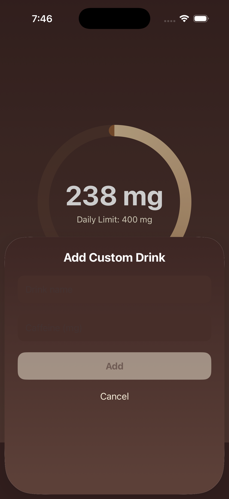
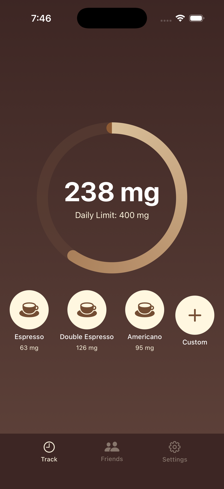

# Espresso - Caffeine Tracker

A beautifully designed iOS app for tracking daily caffeine intake, setting limits, and comparing consumption with friends via a social leaderboard.

## Screenshots

| Track | Custom Drink | Tracking Caffeine | Leaderboard | Settings |
|:---:|:---:|:---:|:---:|:---:|
|  |  |  |  |  |

## Features

### Track Your Caffeine
- Circular progress ring showing real-time caffeine intake vs daily limit
- Quick-add buttons for Espresso (63mg), Double Espresso (126mg), and Americano (95mg)
- Custom drink input — add any beverage with a custom name and caffeine amount
- Animated ring fill with coffee-brown gradient
- SwiftData persistence across sessions

### Friends Leaderboard
- Ranked cards showing friends' caffeine consumption
- Crown badge for the #1 consumer
- Trend indicators (up/down/neutral arrows)
- CloudKit integration for real user data (iCloud sync ready)
- Add friends by username

### Settings
- Adjustable daily caffeine limit (100-800mg slider)
- Profile customization
- Notification toggles
- Clean card-based dark UI

### Custom Tab Bar
- Dark brown themed tab bar matching the app's design
- Replaces the default iOS floating pill for visual consistency

## Tech Stack

- **Platform**: iOS 17+
- **Language**: Swift
- **UI**: SwiftUI
- **Architecture**: MVVM
- **Persistence**: SwiftData
- **Cloud**: CloudKit (iCloud sync)
- **Animations**: SwiftUI spring animations

## Project Structure

```
Espresso/
├── EspressoApp.swift
├── Espresso.entitlements
├── Models/
│   ├── CaffeineEntry.swift
│   ├── Drink.swift
│   └── User.swift
├── Views/
│   ├── ContentView.swift
│   ├── Track/
│   │   ├── TrackView.swift
│   │   ├── CaffeineRingView.swift
│   │   ├── DrinkButtonView.swift
│   │   └── CustomDrinkSheet.swift
│   ├── Friends/
│   │   ├── LeaderboardView.swift
│   │   ├── LeaderboardCard.swift
│   │   └── AddFriendSheet.swift
│   └── Settings/
│       └── SettingsView.swift
├── ViewModels/
│   ├── TrackViewModel.swift
│   ├── LeaderboardViewModel.swift
│   └── SettingsViewModel.swift
└── Services/
    └── CloudKitService.swift
```

## Getting Started

1. Open `Espresso.xcodeproj` in Xcode 15+
2. Select an iOS 17+ simulator
3. Build and run

## License

MIT
